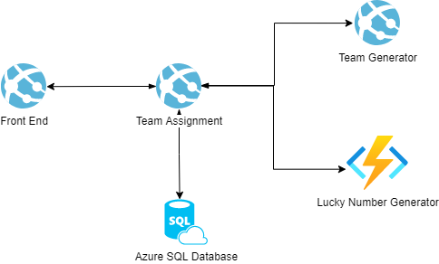

# Random Team Project

## Setup

If you are to run the code contained in this repository as is, you would need to have the following installed on your computer.

- .NET 5 SDK
- Microsoft SQL Server with Windows Authentication(Developer Edition or Express works)
- A code editor (Visual Studio or Visual Studio Code)

> Remember to run `dotnet ef database update` to update your database schema.
## Service Architecture

The code sample contains the following services. Feel free to change any component to something you prefer.

|Service|Azure Resource
|---|---|
Front End App|Azure App Service (Web App)
Team Assignment Service|Azure App Service (Web App)
Team Generator Service|Azure App Service (Web App)
Lucky Number Service | Azure Function App
Database | Azure SQL Database (Feel free to use any other database and modify code to fit your database implementation)
